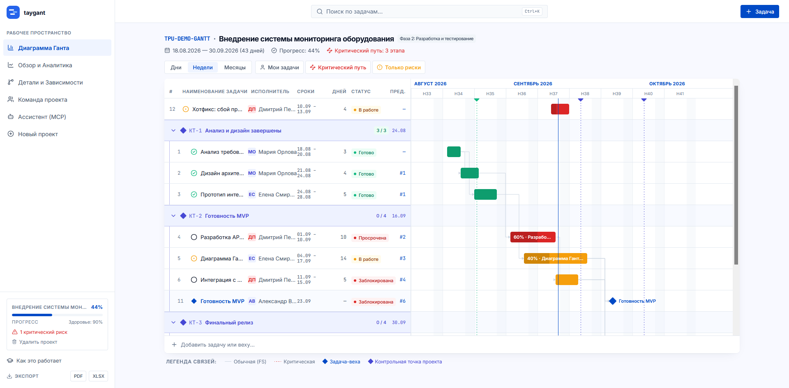

<div align="center" markdown="1">
    
    <h1>taygant</h1>

**Планирование проектов с диаграммой Ганта: сдвинул задачу — сразу видно, что поедет следом.**

</div>



## taygant

taygant (**TA**ke **Y**our **GANT**t) — веб-приложение, в котором проджект-менеджер составляет план проекта и следит за сроками на диаграмме Ганта. Команда видит свои задачи и меняет их статус, а руководитель смотрит, успевает ли проект к сроку.

Приложение сделано для рабочих команд внутри компании и рассчитано на то, чтобы в нём можно было разобраться без обучения.

### Зачем

Когда в проекте много задач, трудно заметить «эффект домино»: одна задача задержалась — и незаметно сдвинулись все, что шли за ней, а вместе с ними и срок проекта. Большие системы управления проектами это умеют, но перегружены функциями и требуют времени на освоение.

taygant отвечает на главные вопросы проекта: какие задачи есть, кто за них отвечает, когда они начинаются и заканчиваются, как зависят друг от друга и что будет, если одна из них сдвинется. Проект сделан на хакатоне по кейсу [«Проект под контролем»](Case.md).

### Как читать диаграмму

- **Полоса** — задача. Её длина — длительность, число на полосе — процент выполнения.
- **Стрелки** — связи между задачами. Пунктирные стрелки — critical path (см. ниже).
- **Ромб в строке задачи** — задача-веха, **ромб в заголовке группы** — контрольная точка проекта. Задачи сгруппированы по контрольным точкам, к которым они ведут; `3 / 3` — сколько задач группы уже готово.
- **Сплошная синяя вертикальная линия** — сегодняшний день.

### Возможности

- **План проекта за пару минут**: проект с датами начала и конца, задачи со сроками, исполнителем и статусом, команда проекта.
- **Связи между задачами**: правило вида «задачу Б нельзя начать, пока не закончена А». Это самый частый тип связи — `FS` (finish-to-start). Поддерживаются и остальные: `SS`, `FF`, `SF`.
- **Каскадный сдвиг**: если перенести задачу, следующие за ней сдвигаются сами. Но только те, кому перенос мешает: если между задачами был запас времени, следующая остаётся на месте. Перенос можно отменить.
- **What-if симулятор**: на странице задачи можно «примерить» сдвиг до сохранения — видно, какие задачи поедут и на сколько сдвинется конец проекта.
- **Critical path (критический путь)**: цепочка задач без запаса времени. Любая задержка в ней сдвигает конец всего проекта. Кнопка «Критический путь» на диаграмме оставляет только эти задачи.
- **Контрольные точки и задачи-вехи**: контрольная точка (например, `КТ-2 Готовность MVP`) — обещание проекта к определённой дате, к ней привязываются задачи, которые к ней ведут. Задача-веха — просто отметка на графике с нулевой длительностью.
- **Рабочий календарь 5/2 или 6/1**: выходные — суббота и воскресенье или только воскресенье. От этого зависит, как считаются сроки задач.
- **Контроль состояния**: на странице «Обзор и Аналитика» видно прогресс, просроченные задачи, риск не успеть к сроку и загрузку людей. Кнопки «Мои задачи» и «Только риски» фильтруют диаграмму.
- **Права в каждом проекте свои**: полный доступ, редактирование или только просмотр. В одном проекте человек может быть менеджером, в другом — участником.
- **История и комментарии**: каждое изменение задачи записывается в историю, и видно, кто его сделал — человек вручную или через ассистента.
- **Поиск и экспорт**: поиск по задачам (`Ctrl+K`) и выгрузка проекта в PDF или XLSX.
- **Подключение к нейронке (MCP)**: можно спросить у Claude Code или Cursor «что у меня сегодня?» и сменить статус задачи, не открывая сайт (см. [ниже](#подключение-к-нейронке-mcp)).

## Запуск

Нужен только [Docker](https://docs.docker.com/get-docker/) с Docker Compose.

Скачайте репозиторий и создайте файл настроек:

```bash
git clone https://github.com/niikage7/taygant.git
cd taygant
cp .env.example .env
```

Заполните в `.env` пароль базы данных и ключ для входа. Сгенерировать их можно так:

```bash
openssl rand -hex 24   # для POSTGRES_PASSWORD
openssl rand -hex 32   # для JWT_SECRET
```

Запустите приложение:

```bash
docker compose up --build
```

Приложение откроется на [http://localhost:3000](http://localhost:3000). Каждый пользователь регистрируется сам; кто создал проект, тот добавляет в него остальных по почте.

Чтобы сразу посмотреть на готовый проект, как на скриншоте, включите демо-данные: `SEED_DEMO_DATA=true` в `.env`. Войти можно как проджект-менеджер `volkov@taygant.dev`, пароль `demo1234` (он общий для всех демо-пользователей).

Полезные команды:

```bash
docker compose logs -f backend   # логи бэкенда
docker compose down -v           # остановить и удалить все данные
```

### Настройки

Все настройки лежат в `.env` рядом с `docker-compose.yml`.

| **Переменная**      | **Что это**                                                      | **Обязательна** |
| ------------------- | ---------------------------------------------------------------- | --------------- |
| `POSTGRES_USER`     | Пользователь базы данных PostgreSQL.                             | да              |
| `POSTGRES_PASSWORD` | Пароль базы данных. Придумайте свой, не берите из примера.        | да              |
| `POSTGRES_DB`       | Название базы данных.                                            | да              |
| `JWT_SECRET`        | Секретный ключ, которым подписываются токены входа в аккаунт.    | да              |
| `SEED_DEMO_DATA`    | `true` — при первом запуске создать демо-команду и демо-проект.  | нет, `false`    |

Без обязательных переменных `docker compose` не запустится и подскажет, чего не хватает.

### Подключение к нейронке (MCP)

MCP (Model Context Protocol) — стандартный способ подключить к нейронке внешнее приложение. taygant подключается к Claude Code, Cursor и другим клиентам с поддержкой MCP.

1. Откройте в приложении раздел **«Ассистент (MCP)»** и создайте личный ключ.
2. Скопируйте готовую команду или конфиг для своего клиента. Для Claude Code это выглядит так:

```bash
claude mcp add --transport http --scope user taygant http://localhost:3000/backend/mcp --header "Authorization: Bearer <ваш ключ>"
```

Нейронка видит только проекты владельца ключа и может:

| **Инструмент**     | **Что делает**                                                              |
| ------------------ | --------------------------------------------------------------------------- |
| `my_tasks`         | Мои задачи: «что у меня сегодня?», «что у меня горит?»                      |
| `get_task`         | Всё о задаче: описание, чек-лист, связи, история и комментарии              |
| `set_task_status`  | Сменить статус задачи: `planned`, `in_progress` или `done`                   |
| `list_my_projects` | Мои проекты: сроки, прогресс, число просрочек                               |
| `project_status`   | Сводка по проекту: успевает ли он к сроку, прогресс, что готово и что в работе |
| `project_risks`    | Проблемы проекта, самые срочные первыми                                     |

Статус нейронка меняет только после подтверждения человеком, а в истории задачи такое изменение помечается «через ассистента». Подробнее — в [docs/mcp.md](docs/mcp.md).

## Разработка

**Из чего сделан:**

- **Backend** — Go, [Fiber](https://gofiber.io/) (веб-сервер), [GORM](https://gorm.io/) (работа с базой), PostgreSQL 17. Описание API — в [backend/api-spec.yml](backend/api-spec.yml).
- **Frontend** — [Next.js](https://nextjs.org/) 16, React 19, Tailwind CSS, TanStack Query.
- **MCP-сервер** — встроен в backend, на [официальном Go SDK](https://github.com/modelcontextprotocol/go-sdk).

**Где что лежит:**

```
backend/    сервер на Go: API, расчёт сроков и critical path, MCP
frontend/   интерфейс на Next.js
docs/       описание продукта (product.md) и MCP (mcp.md)
Case.md     условие кейса хакатона
```

**Запуск без Docker** (удобно, когда меняете код):

1. Поднимите только базу: `docker compose up -d postgres`.
2. Запустите backend на порту `4000`:
   ```bash
   cd backend
   DATABASE_URL="postgres://taygant:<пароль>@localhost:5432/taygant?sslmode=disable" JWT_SECRET=<ключ> go run .
   ```
3. Запустите frontend на порту `3000`:
   ```bash
   cd frontend
   pnpm install
   pnpm dev
   ```

**Проверки.** Тесты backend — `go test ./...` в папке `backend`. Интеграционные тесты API запускаются, только если задан `TEST_DATABASE_URL` (адрес тестовой базы). Для frontend — `pnpm lint`.

При каждом push в ветку `dev` GitHub Actions проверяет код (gofmt, go vet, тесты, ESLint, TypeScript, сборка), запускает приложение целиком для smoke-теста и выкладывает его на сервер.

<br />
<br />
<div align="center">

Сделано командой taygant · [MIT License](LICENSE)

</div>
